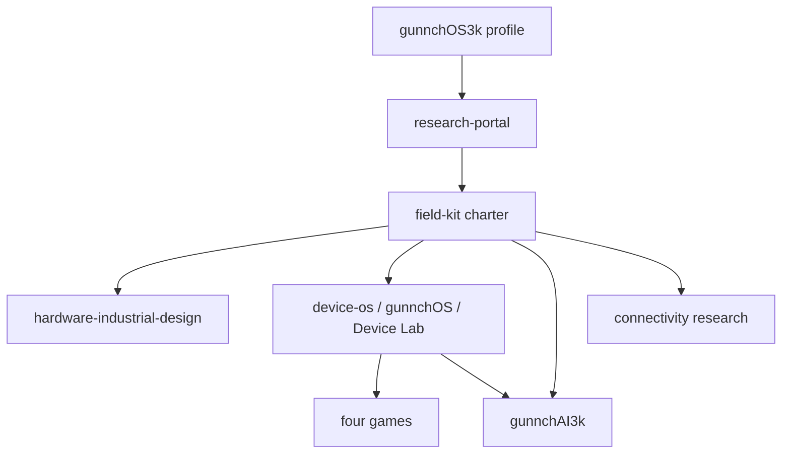

# gunnchOS3k Repository Catalog

Generated from `artifacts/wp012/REPO_CATALOG.yaml` (schema `gunnchos.repo_catalog.v1`).

**Control plane:** `None`  
**Ecosystem portal:** `None`  
**Profile front door:** `None`

## Claim boundary

## Repositories

| Repo | Category | Purpose | Layer | State | Physical pending | External pending |
|---|---|---|---|---|---|---|
| `gunnchOS3k` | profile | GitHub front door | 16 | INTEGRATED | False | False |
| `gunnchos-research-portal` | portal | Canonical ecosystem information architecture | 16 | IMPLEMENTATION_IN_PROGRESS | False | False |
| `gunnchos-7gc-ai-ran-field-kit` | control_plane | Program control, charter, evidence aggregation | 16 | INTEGRATED | False | False |
| `gunnchos-hardware-industrial-design` | hardware | Industrial/electrical design SoT | 1 | PHYSICAL_PENDING | True | True |
| `gunnchos-device-os` | os | gunnchOS + Device Lab | 4 | DIGITALLY_VALIDATED | True | False |
| `gunnchAI3k` | ai | Local-first intelligence | 5 | INTEGRATED | False | False |
| `edge-io-measurement-node` | input | Ring sensing/measurement | 7 | PHYSICAL_PENDING | True | False |
| `waike-research-ops` | education_ops | WAIKE research operations | 14 | INTEGRATED | False | True |
| `anime-aggressors` | game | Anime Aggressors | 9 | INTEGRATED | False | False |
| `pedestrian-pursuit` | game | Pedestrian Pursuit | 9 | INTEGRATED | False | False |
| `archive-of-life-artifact-world` | game | Archive of Life | 9 | INTEGRATED | False | False |
| `beatlink-party` | game | Beat Link | 9 | INTEGRATED | False | False |
| `ntn-resilience-sim` | connectivity | NTN resilience simulation | 6 | DIGITALLY_VALIDATED | False | False |
| `spectrumx-ai-ran-gary` | research | AI-RAN equitable spectrum research | 6 | DIGITALLY_VALIDATED | False | False |
| `7gc-digital-twin` | twin | 7GC digital twin research (not product spine) | 10 | DIGITALLY_VALIDATED | False | False |

## Architecture (Mermaid)

## Where do I contribute?

- **Charter / evidence / work packets:** `gunnchos-7gc-ai-ran-field-kit`
- **OS / Device Lab:** `gunnchos-device-os`
- **Hardware:** `gunnchos-hardware-industrial-design`
- **AI:** `gunnchAI3k`
- **Games:** respective game repos
- **Education / WAIKE:** `waike-research-ops`
- **Public docs:** `gunnchos-research-portal`

Every core README should link back to the Ecosystem Portal.
