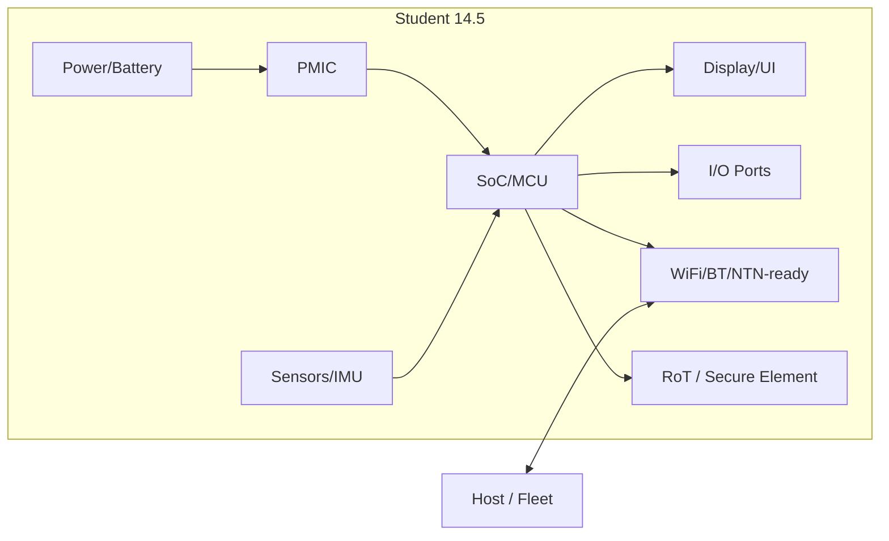

# Block diagram — Student 14.5

```mermaid
flowchart LR
  subgraph student_14_5[Student 14.5]
    PWR[Power/Battery] --> PMIC[PMIC]
    PMIC --> SOC[SoC/MCU]
    SOC --> DISP[Display/UI]
    SOC --> IO[I/O Ports]
    SOC --> RF[WiFi/BT/NTN-ready]
    SOC --> SEC[RoT / Secure Element]
    IMU[Sensors/IMU] --> SOC
  end
  HOST[Host / Fleet] <--> RF
```

