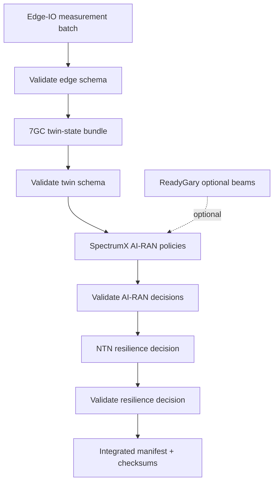

# Gate 2 Architecture

```mermaid
flowchart TD
  EDGE[Edge-IO measurement batch] --> VAL1[Validate edge schema]
  VAL1 --> TWIN[7GC twin-state bundle]
  TWIN --> VAL2[Validate twin schema]
  VAL2 --> AIRAN[SpectrumX AI-RAN policies]
  AIRAN --> VAL3[Validate AI-RAN decisions]
  VAL3 --> NTN[NTN resilience decision]
  NTN --> VAL4[Validate resilience decision]
  VAL4 --> MAN[Integrated manifest + checksums]
  RG[ReadyGary optional beams] -. optional .-> AIRAN
```

The field-kit owns canonical contracts under `contracts/`.
Component repositories consume schemas via `--schema-dir` / `GATE2_CONTRACTS_DIR`.
