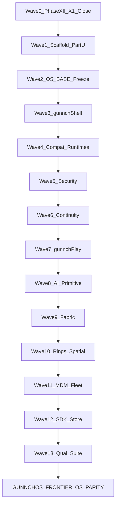

# Phase XIII — Frontier OS Parity Campaign Plan

**Status:** PLAN ONLY (not execution)  
**Scope amendment:** Option **4** (full campaign) **+** Option **2** (mandatory Wave 0 = Phase XII X1 close)  
**Doctrine:** `PHYSICAL_EXECUTION_FREEZE=ACTIVE` · DRAFT PRs only · Cursor never merges · never claim `GUNNCHOS_FRONTIER_OS_PARITY` without Part Q evidence · `FULL_GUNNCHOS_PLATFORM_DIGITAL_COMPLETE` remains historical/internal  

**Workspace:** `/Users/gunnchos/Downloads/gunnchos-7gc-research-product-spine/repos`

---

## 0. Claim boundaries (non-negotiable)

| Token | Rule |
|---|---|
| `FULL_GUNNCHOS_PLATFORM_DIGITAL_COMPLETE` | Historical/internal only; firewall already treats assertive TRUE as forbidden without evidence |
| `GUNNCHOS_FRONTIER_OS_PARITY` | Reject until all Part Q gates are non-`INCOMPLETE_DIGITAL` with prove artifacts |
| `GUNNCHOS_REAL_*_DAY_DIGITAL_PASS` | Remain FALSE while any Phase XII `CI_X1_RESIDUALS` open |
| `FEATURE_EXISTS != PARITY` | Parity = implemented + integrated + executed + reliable + performant + secure + accessible + understandable + failure-tested + reproducible + competitive UX |

Forbidden without evidence (unchanged): `PRODUCTION_READY`, `MASS_PRODUCTION`, `CERTIFIED`, `CARRIER_APPROVED`, `6G_CERTIFIED`, `GATE_8_PASS`, `EVT_VALIDATED`, `PRODUCTION_SECURITY_VALIDATED`, `PHYSICAL_*_PARITY`, `MASS_MARKET_APP_COMPATIBILITY`.

---

## 1. Current baseline (accepted mains)

| Repo | Tip (as of honesty merge) | Notes |
|---|---|---|
| device-os | `af461da…` (#72 honesty on #71 Phase XII) | Phase XII CI green; X1=5 |
| field-kit | `d8ac4f0…` (#47 honesty on #46) | Firewall enforces X1 honesty |
| Phase X | `b1ac56bb…` (#44) | RFQ packets unsent |

Authoritative residual register:

- [program/execution_reality/CI_X1_RESIDUALS.json](../execution_reality/CI_X1_RESIDUALS.json)
- Mirror: `artifacts/phase_xii/CI_X1_RESIDUALS.json` (both repos)

```
REAL_APP_X0_OPEN = 0
REAL_APP_X1_OPEN = 5   # CONDITIONAL_EXTERNAL
REAL_APP_X2_OPEN = 0
```

Open X1:

1. `RJ-GAME-001` — anime-aggressors (Godot / sibling missing on CI)
2. `RJ-GAME-002` — pedestrian-pursuit
3. `RJ-GAME-003` — archive-of-life-artifact-world
4. `RJ-GAME-004` — beatlink-party
5. `RJ-STUDENT-001` — llama/AI runtime + composite overlay (`XR-DEFECT-AI-RUNTIME`)

---

## 2. Landing layout (naming convention)

| Layer | Path |
|---|---|
| Field-kit control plane | `program/frontier_os_parity/` |
| Field-kit artifacts mirror | `artifacts/phase_xiii/` |
| Frontier claim firewall | `program/claims/phase_xiii_frontier_os_parity_firewall.yaml` |
| Device-os runtime | `gunnchos_device_os/phase_xiii/` |
| Device-os artifacts | `artifacts/phase_xiii/` |
| Device-os OS build | `os_build/phase_xiii/` |
| Device-os CI | `.github/workflows/phase-xiii-frontier-os-parity.yml` |
| Branches | `phase-xiii/frontier-os-parity` (+ wave suffixes) |

Reuse existing validators: extend [scripts/validate_claim_firewall.py](../../scripts/validate_claim_firewall.py) (same pattern as `check_phase_xii_execution_depth`).

Do **not** bury under `program/full_product/continuation_*` — Continuations V–IX stay digital-release totality; Frontier is Phase XIII.

---

## 3. Wave map (multi-session)



Each wave: implement → prove scripts → artifacts → DRAFT PR(s) → Edmund merges → pin `ACCEPTED_MAIN_BASELINE` → next wave. Cursor never merges; `autoMergeRequest=null`.

---

## 4. Wave 0 — Phase XII X1 residual closure (MANDATORY before OS-BASE)

**Goal:** `REAL_APP_X1_OPEN = 0` on accepted-main CI; enable honest `GUNNCHOS_REAL_*_DAY_DIGITAL_PASS` only when L4/L5 RJ evidence + firewall rules pass.

**Owners:**

| Residual | Primary owner repo | Supporting |
|---|---|---|
| RJ-GAME-001..004 | `gunnchos-device-os` (`phase_xii` games adapters + CI) | sibling game repos / vendored fixtures |
| RJ-STUDENT-001 | `gunnchos-device-os` + `gunnchAI3k` | field-kit residual register |

**Concrete work:**

1. **Games CI path**
   - Extend `.github/workflows/phase-xii-execution-reality.yml` to install Godot (pinned version) **or** checkout sibling game repos as CI dependencies.
   - Prefer Cont IX pattern: vendored minimal launch fixtures under `gunnchos_device_os/phase_xii/fixtures/games/` **only if** they still launch real Godot/Vite/vitest processes (no fixture-JSON-as-gameplay regression).
   - Prove scripts: `scripts/run_phase_xii_rj.py` / game adapters must report process-level L4+.

2. **Student AI path**
   - Ensure `llama-server` + pinned GGUF installable on Linux CI (cache artifact or download step).
   - Fix composite overlay that masks journey FAIL as pass (`XR-DEFECT-AI-RUNTIME`).
   - RJ-STUDENT-001 must fail closed if AI runtime unavailable.

3. **Evidence updates (both repos)**
   - Rewrite `CI_X1_RESIDUALS.json` → `REAL_APP_X1_OPEN: 0`, empty `open_x1`.
   - Update `DEFINITION_OF_DONE.json`, `JOURNEY_TOKENS.json`, `REALITY_DEPTH_LEDGER.json`.
   - Only then flip `GUNNCHOS_REAL_*_DAY_DIGITAL_PASS` true where L4/L5 earned.

4. **DRAFT PRs**
   - device-os primary (games + AI CI)
   - field-kit last (residual register + token honesty + baseline pin)

**Exit criteria:** CI `reality` green **and** residual register X1=0 **and** claim firewall PASS with REAL day tokens consistent. Until then Wave 2+ must not claim real-day digital pass.

---

## 5. Wave 1 — Phase XIII scaffolding (Part U document DoD)

**Goal:** Requirements document is machine-operable; parity cannot be earned from schema/mocks alone.

**Deliverables under `program/frontier_os_parity/`:**

| Artifact | Purpose |
|---|---|
| `REQUIREMENTS.md` | Normative copy of Frontier OS Parity Requirements (Parts A–U) |
| `REQUIREMENT_OWNERS.yaml` | Every `OS-*` ID → owner repo + role (Cursor / Edmund / External) |
| `PARITY_GATES.yaml` | All Part Q gates with status enum |
| `PARITY_GATES.schema.json` | Schema: gate_id, status, owner, evidence[], blockers[], digital_vs_physical |
| `REQUIREMENT_TO_GATE_MAP.yaml` | OS-BASE-001 → BOOT_SECURITY / UPDATE_ROLLBACK / … |
| `ACCEPTED_MAIN_BASELINE.json` | Pins Wave 0 merged SHAs |
| `DEFINITION_OF_DONE.json` | Matrix of Part Q gate statuses (initially mostly `INCOMPLETE_DIGITAL`) |
| `PHASE_XII_INTEGRATION.json` | Links to Phase XII RJ/depth ledger; records X1 close SHA |
| `COMPETITIVE_BENCHMARK_MAP.yaml` | Part 3 table, machine-readable |
| `PRIORITY_ORDER.yaml` | Part S 1–15 as wave bindings |
| `CLAIM_BOUNDARY.md` | Part T restatement |

**Firewall:** `program/claims/phase_xiii_frontier_os_parity_firewall.yaml`

```yaml
# Conceptual rules (to implement)
- reject GUNNCHOS_FRONTIER_OS_PARITY unless all gates != INCOMPLETE_DIGITAL
- reject PRODUCTION_SECURITY_VALIDATED / PHYSICAL_*_PARITY without physical evidence
- reject FEATURE_EXISTS as PARITY (require prove artifact paths)
- require Phase XII X1=0 before asserting REAL day + any frontier USER_EXPERIENCE COMPLETE_DIGITAL
```

Wire into `validate_claim_firewall.py` as `check_phase_xiii_frontier_parity()`.

**Device-os stub (no feature claim):**

- `gunnchos_device_os/phase_xiii/__init__.py` + `prove_phase_xiii_scaffold.py` emitting `artifacts/phase_xiii/SCAFFOLD_PASS.json`
- Workflow `phase-xiii-frontier-os-parity.yml` (scaffold validate only)

**Owners file seed (default assignments):**

| Requirement family | Owner |
|---|---|
| OS-BASE-* | device-os |
| OS-SEC-* | device-os (+ hardware for physical RoT) |
| OS-SHELL-* | device-os |
| OS-COMPAT-* / OS-STORE-* | device-os + field-kit matrix |
| OS-CONT-* / OS-FABRIC-* | device-os |
| OS-PLAY-* | device-os + game siblings |
| OS-AI-* | device-os + gunnchAI3k |
| OS-SPATIAL-* | device-os + edge-io |
| OS-NET-* | device-os + field-kit 7GC plans |
| OS-MDM-* | device-os + field-kit fleet |
| OS-SDK-* | device-os |
| OS-A11Y-* / OS-LIFE-* | device-os + field-kit policy |
| Part N performance gates | device-os prove + PHYSICAL_PENDING metrics |
| Part R qualification suite | field-kit orchestrates; device-os executes |

**DRAFT PRs:** field-kit (control plane) + device-os (scaffold prove). Merge order: device-os then field-kit if pins required, else field-kit-only if device-os stub lands first with no pin race.

**Exit criteria:** Part U checklist true — owners, machine-readable gates, digital→evidence map, physical/external separately blocked, Phase XII evidence linked, firewall rejects mock-only parity.

---

## 6. Wave 2 — Production OS architecture freeze (Part S #2 / OS-BASE-001..003)

**Gates targeted:** `BOOT_SECURITY` (digital arch), `UPDATE_ROLLBACK`, `RECOVERY`, `DRIVER_HAL` (matrix start)

**Concrete design choices (locked for this campaign):**

| Decision | Choice |
|---|---|
| Image/update tech | **RAUC-style A/B slots** (or systemd-sysupdate equivalent) described + digitally simulated on reference image |
| Kernel | **Distro LTS** (Ubuntu/Debian LTS or pinned mainline LTS) — no custom kernel vanity; document support matrix |
| Mutable layers | `/apps`, `/data`, `/home`, `/dev-environments`, `/games`, `/models` separate from signed base |
| Recovery | Dedicated recovery slot/image + offline reinstall + factory reset policy + developer path |
| Compositor baseline | Keep **Weston** as CI/host compositor until Wave 3 gunnchShell owns session |

**Implementation paths:**

- `os_build/phase_xiii/base/{kernel_policy.md,support_matrix.yaml,ab_slots.yaml,update_rollback_sim.py,recovery/}`
- Prove: actual update → inactive slot → verify → reboot sim → health → PASS/FAIL rollback; user data survives
- Artifacts: `artifacts/phase_xiii/base/{UPDATE_ROLLBACK.json,RECOVERY.json,KERNEL_POLICY.json}`

**Statuses expected:** `UPDATE_ROLLBACK` / `RECOVERY` → `COMPLETE_DIGITAL` if sim+tests green; TPM/SE physical RoT → `PHYSICAL_PENDING`.

---

## 7. Waves 3–13 — Part S priorities 3→N (summary contracts)

Each wave opens DRAFT PRs with gate status transitions only when prove artifacts exist.

### Wave 3 — Adaptive gunnchShell (OS-SHELL-001..005)

**Gates:** `GRAPHICS_COMPOSITOR`, `DESKTOP_SHELL`, `TOUCH_TABLET_SHELL`, `DUAL_SCREEN_SHELL`, `HANDHELD_SHELL`, `DOCK_TRANSITION`  
**Path:** `gunnchos_device_os/phase_xiii/shell/` + `os_build/phase_xiii/shell/`  
**Benchmark:** Windows/macOS desktop; iPadOS touch; SteamOS handheld  
**Build on:** Phase XII Weston session; one shell adapts modes (not separate OSes)

### Wave 4 — Multi-runtime compatibility (OS-COMPAT-001..004)

**Gates:** `APP_RUNTIME`, `APP_COMPATIBILITY`  
**Path:** `phase_xiii/compat/{lanes.yaml,corpus/,classify.py}`  
**Lanes:** native, Linux, Flatpak, Web/PWA, OCI, Steam/Proton (legal), optional Android study (evaluate-only)  
**Classifications earned from execution:** NATIVE / VERIFIED / PLAYABLE / LIMITED / UNSUPPORTED / UNKNOWN

### Wave 5 — Security harden (OS-SEC-001..003)

**Gates:** `BOOT_SECURITY`, `SANDBOX_PERMISSIONS`, `IDENTITY`, `ENCRYPTION_KEYSTORE`  
**Digital now:** manifests, policies, DEV keys, verification tests, anti-rollback sim  
**Physical later:** TPM/SE validation → `PHYSICAL_PENDING`

### Wave 6 — gunnchContinuity (OS-CONT-001..004)

**Gates:** `SYNC`, `CONTINUITY`, `FILES_STORAGE`  
**Path:** `phase_xiii/continuity/{clipboard,files,app_state,peripherals}`  
**Properties:** permission-aware, encrypted transit, opt-out, conflict-safe; checkpoint-and-resume if live migrate unsafe

### Wave 7 — gunnchPlay (OS-PLAY-001..004)

**Gates:** `GAME_RUNTIME`, `GAME_COMPATIBILITY`, `GAME_SOCIAL`, `GAME_SUSPEND_RESUME`, `REMOTE_PLAY`  
**Requires Wave 0 games CI solid**  
**No multi-title Quick Resume claim without runtime proof**

### Wave 8 — gunnchAI OS primitive (OS-AI-001..002)

**Gates:** `LOCAL_AI`, `AI_SYSTEM_API`  
**Capability API:** summarize/translate/tutor/code/… with local/edge/cloud/deny policy  
**Context auth:** explicit, scoped, revocable, auditable

### Wave 9 — gunnchFabric (OS-FABRIC-001..002)

**Gates:** capability discovery/trust (map into `CONNECTIVITY_5GA` + fabric-specific evidence)  
**Apps request capabilities; OS selects authenticated provider across Student/DS-XL/Handheld/Dock/Rings/edge**

### Wave 10 — Rings spatial input (OS-SPATIAL-001..002)

**Gates:** `RING_SPATIAL_INPUT`  
**Fusion arch (not IMU-only):** IMU + ranging + optical/UWB where applicable + calibration/confidence  
**System-wide input:** typing/pointer/scroll/selection/shortcuts/games/target switch  
**Physical pose error:** `PHYSICAL_PENDING`

### Wave 11 — School/enterprise MDM (OS-MDM-001..002)

**Gates:** `ENTERPRISE_MDM`, `EDUCATION_MANAGEMENT`  
**Privacy:** admin manage without student docs/messages/AI memory/game saves**

### Wave 12 — Developer SDK + distribution (OS-SDK-001..002, OS-STORE-001..002)

**Gates:** `DEVELOPER_SDK`, `DEBUG_PROFILING`, `PACKAGE_MANAGEMENT`, `APP_DISTRIBUTION`  
**Store payments phased; distribution model cannot remain undefined**

### Wave 13 — Competitive qualification + performance gates (Parts N, O, P, R)

**Gates:** `PERFORMANCE_POWER`, `ACCESSIBILITY`, `SUPPORT_LIFECYCLE`, `USER_EXPERIENCE`, `NTN_MIGRATION` (sim only; no false modem claims)  
**Suite:** grow toward ~1000 workflows; metrics from Part R outcome list  
**Lifecycle years:** document targets; do **not** claim 5–10y support until business commitment exists → else `EXTERNAL_PENDING`

---

## 8. Part Q gate registry (initial machine representation)

All gates start in `PARITY_GATES.yaml` with:

```yaml
status: INCOMPLETE_DIGITAL | COMPLETE_DIGITAL | COMPLETE_CONDITIONAL_EXTERNAL | PHYSICAL_PENDING | EXTERNAL_PENDING
owner: <repo>
evidence: []
blockers: []
wave: <0-13>
```

Seed statuses after Wave 1 (illustrative — exact file is authoritative):

| Gate | Initial post-Wave1 | Notes |
|---|---|---|
| Most digital gates | `INCOMPLETE_DIGITAL` | Until wave prove |
| Phase XII-linked UX slices | may be `COMPLETE_CONDITIONAL_EXTERNAL` | Only if Wave 0 closed and evidence linked |
| Physical RoT / power / RF | `PHYSICAL_PENDING` | Freeze active |
| Vendor/cert/carrier/support years | `EXTERNAL_PENDING` | Edmund/external |

**Parity earn rule:** `GUNNCHOS_FRONTIER_OS_PARITY=TRUE` only when zero gates are `INCOMPLETE_DIGITAL` and firewall + prove suite green. Conditional/physical/external gates must be explicitly classified — never hidden.

---

## 9. PR / CI / merge protocol

1. Cursor implements on wave branches; opens **DRAFT** PRs; `autoMergeRequest=null`.
2. Primary implementation PR on **device-os** (and siblings as needed).
3. **field-kit LAST** — evidence consumer, baseline pins, firewall, gate matrix.
4. Edmund reviews/merges; Cursor never merges.
5. Post-merge: refresh `ACCEPTED_MAIN_BASELINE.json`; no stale draft SHAs (firewall already rejects `ce604c23…` pattern).
6. Physical freeze: no purchase, fab, flash, NDA accept, external RFQ send.

---

## 10. Session execution order (for implementers)

| Session | Wave | Primary DRAFT PRs |
|---|---|---|
| S0 | Wave 0 X1 close | device-os, field-kit |
| S1 | Wave 1 scaffolding Part U | field-kit (+ device-os stub) |
| S2 | Wave 2 OS-BASE | device-os, field-kit |
| S3 | Wave 3 Shell | device-os, field-kit |
| S4 | Wave 4 Compat | device-os, field-kit |
| S5 | Wave 5 Security | device-os, field-kit |
| S6 | Wave 6 Continuity | device-os, field-kit |
| S7 | Wave 7 Play | device-os (+ games), field-kit |
| S8 | Wave 8 AI API | device-os, gunnchAI, field-kit |
| S9 | Wave 9 Fabric | device-os, field-kit |
| S10 | Wave 10 Rings | device-os, edge-io, field-kit |
| S11 | Wave 11 MDM | device-os, field-kit |
| S12 | Wave 12 SDK/Store | device-os, field-kit |
| S13 | Wave 13 Qual suite | field-kit orchestrates, device-os prove |

---

## 11. Recommendation string (post-plan approval)

```
APPROVE_PLAN → EXECUTE_WAVE_0_PHASE_XII_X1_CLOSE → THEN_WAVE_1_SCAFFOLD → THEN_WAVES_2_TO_13
GUNNCHOS_FRONTIER_OS_PARITY = NOT_CLAIMABLE
PHYSICAL_EXECUTION_FREEZE = ACTIVE
```

---

## 12. Out of scope for plan approval

- Implementation coding (starts only after user says execute)
- Merging PRs
- Purchasing / RFQ send / NDA
- Claiming frontier parity or real-day pass before Wave 0 evidence
